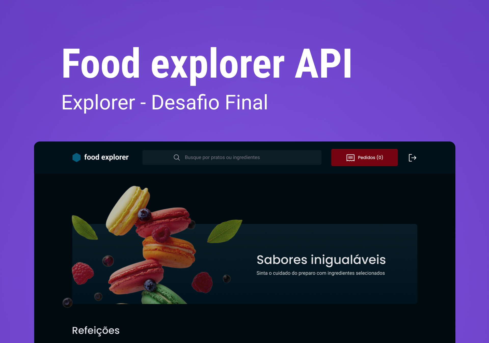

# Food Explorer API

## Sobre o Projeto

A FoodExplorer API é uma solução inovadora desenvolvida por mim para o Desafio Final do curso Explorer da Rocketseat. Esta API robusta e confiável foi projetada para transformar a gestão de catálogos de pratos em restaurantes, incorporando funcionalidades avançadas como cadastro, atualização, exclusão, e listagem de pratos, além de autenticação de usuários e controle de acesso diferenciado. Com o uso de tecnologias de ponta e uma arquitetura planejada para escalabilidade, o FoodExplorer API está preparado para implementação e melhorias em ambientes reais, oferecendo uma solução completa para digitalizar a experiência gastronômica.



## Demonstração Online

A API está disponível para testes e demonstração no seguinte endereço: [apifoodexplorer-6mfn.onrender.com/](https://api-foodexplorer-6mfn.onrender.com/). Sinta-se à vontade para explorar as funcionalidades e testar os endpoints disponíveis para ter uma ideia da capacidade e do desempenho da API em um ambiente de produção real.

## Funcionalidades Principais

- **Autenticação e autorização de Usuários**: Segurança reforçada com login e registro utilizando JWT, garantindo que apenas usuários autenticados possam acessar a aplicação e funcionalidades específicas.
- **Gerenciamento de Pratos**: Facilita a adição, listagem, modificação e remoção de pratos, simplificando o controle do catálogo.
- **Busca Avançada**: Permite aos usuários encontrar pratos por nome, categoria ou ingredientes, melhorando a experiência de busca.
- **Níveis de Acesso**: Implementa controles de acesso para administradores e clientes, assegurando a execução segura de operações críticas.
- **Upload de Imagens**: Oferece suporte para o upload de imagens dos pratos, enriquecendo a apresentação do catálogo.

## Tecnologias Utilizadas

- **Node.js** e **Express**: Para construção de uma API eficiente e escalável.
- **JWT (JSON Web Tokens)**: Para autenticação segura e gestão de sessões.
- **SQL** e **Knex.js**: Para um gerenciamento de banco de dados e construção de queries.
- **Multer**: Para gerenciamento eficiente de uploads de imagens.
- **PM2**: Para otimização do gerenciamento de processos e garantia de disponibilidade.

## Arquitetura do Projeto

Este projeto adota uma arquitetura baseada na separação clara de responsabilidades, compreendendo:

- **Controllers**: Para o tratamento de requisições e respostas HTTP.
- **Repositories**: Para abstração da lógica de acesso a dados.
- **Services**: Para encapsulamento da lógica de negócios, promovendo reuso e desacoplamento.
- **Middlewares**: Incluindo um middleware de autenticação que verifica a role do usuário, permitindo que apenas administradores executem determinadas ações.

Esta abordagem garante não apenas a escalabilidade do projeto, mas também sua manutenibilidade, facilitando expansões ou modificações futuras.

## Pronto para o Mercado

O FoodExplorer API transcende o escopo de um projeto acadêmico, apresentando-se como uma solução de mercado viável, com apenas alguns ajustes estará pronta para implementação. Graças à sua base sólida, uso de tecnologias atualizadas e arquitetura pensada para o futuro, este projeto é ideal para restaurantes que buscam inovar no gerenciamento de seus catálogos de pratos e proporcionar uma experiência digital aprimorada aos seus clientes.

## Colocando em Produção

Para colocar a FoodExplorer API em produção, siga os passos abaixo. Este guia pressupõe que você já tem um ambiente de servidor preparado para hospedar aplicações Node.js e um banco de dados configurado e pronto para uso.

### Clonando o Projeto

Primeiro, clone o repositório do projeto para a sua máquina local usando o Git:

`
git clone https://github.com/ismael-figueiredo/Food-Explorer-Back-end.git
cd Food-Explorer-Back-end`

1. **Configuração do Ambiente de Servidor**: Certifique-se de que seu servidor tem o Node.js instalado. Recomendamos o uso do NVM (Node Version Manager) para gerenciar versões do Node.js.
2. **Banco de Dados**: A API foi configurada para usar SQlite com Knex.js. Garanta que seu banco de dados esteja operacional e acessível a partir do seu servidor.

### Configurações de Ambiente

1. **Variáveis de Ambiente**: Configure as variáveis de ambiente necessárias para a aplicação. 
    - Crie um arquivo `.env` na raiz do seu projeto e preencha com as suas variáveis de configuração. Por exemplo:

    ```env
    AUTH_SECRET="seu_segredo_jwt"
    SERVER_PORT="sua_porta"
    ```

### Rodando

2. **Instalação de Dependências**: No diretório do projeto no servidor, execute `npm install` para instalar todas as dependências necessárias.
3. **Migrações do Banco de Dados**: Execute as migrações do banco de dados para configurar sua estrutura. Utilize o Knex.js para fazer isso, com o comando `npm migrate`.
4. **Iniciando a Aplicação**: Inicie sua aplicação usando um gerenciador de processos como o PM2. Isso ajudará a manter sua aplicação rodando e a reiniciar automaticamente em caso de falhas. Execute `npm start` para iniciar sua aplicação.
